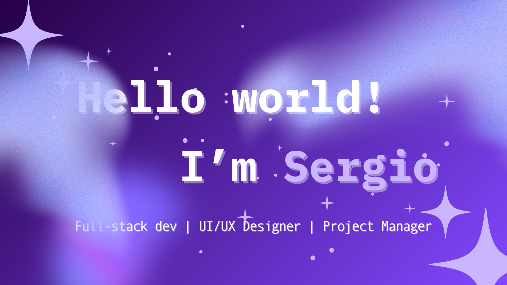
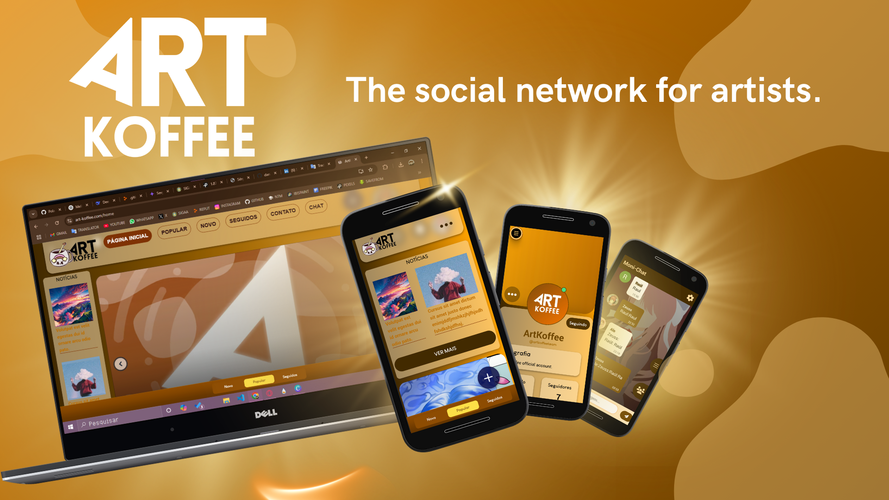
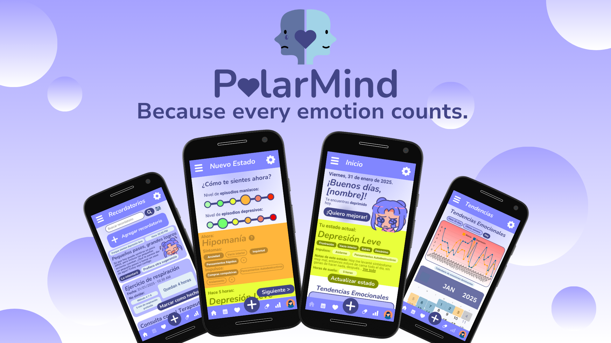
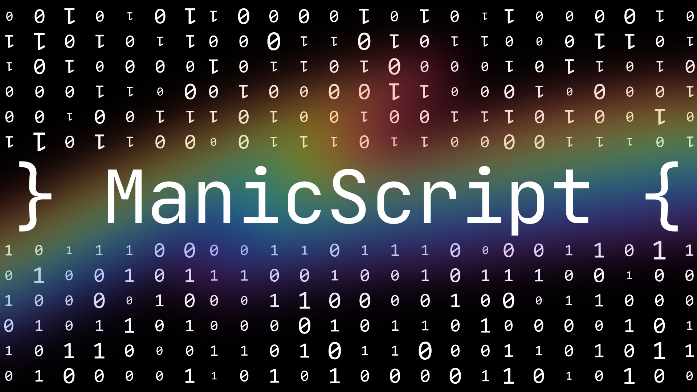
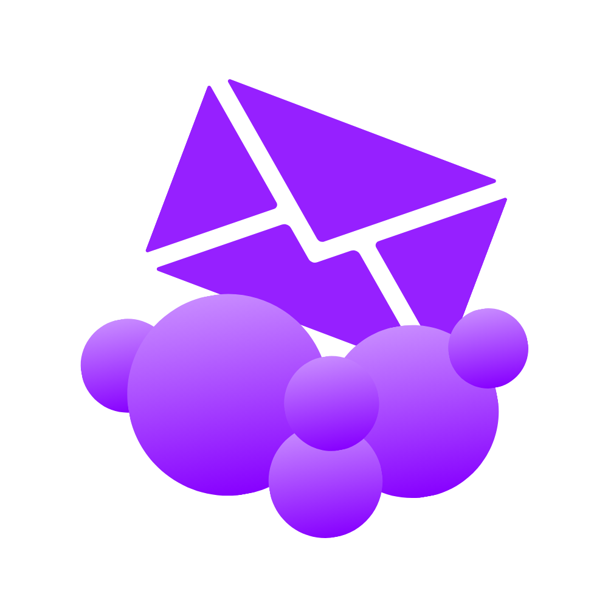
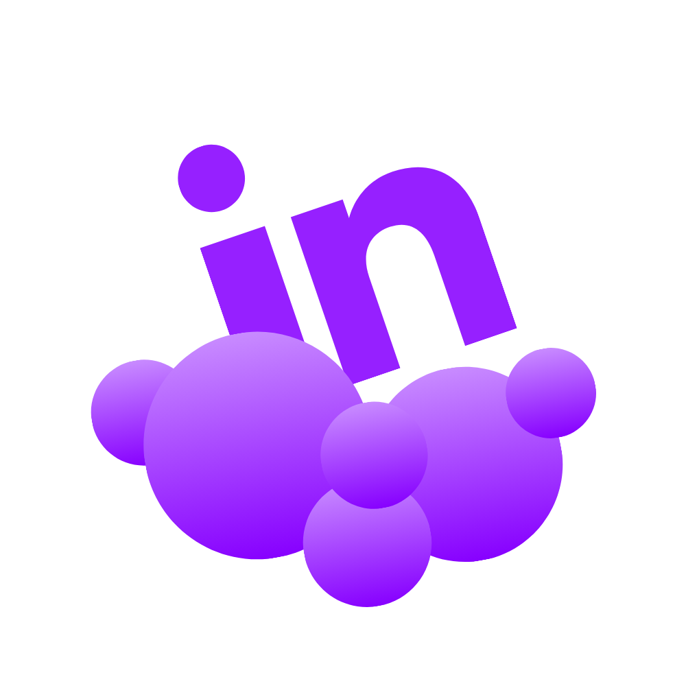
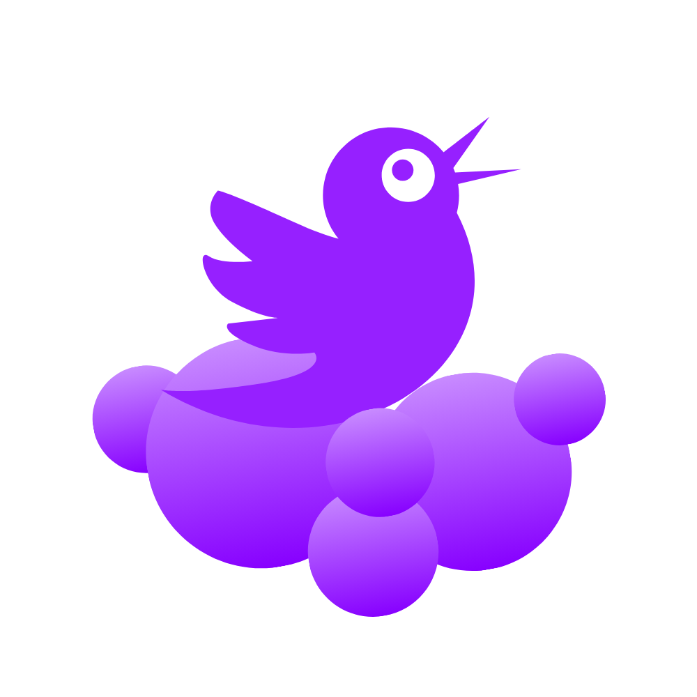

<table>
  <tr>
    <td>
      
    </td>
    <td>
      
    </td>
    <td>
       
      
    </td>
  </tr>
</table>
    

  <h2>Avançado nas seguintes tecnologias:</h2>
  
  
  
  
  
  
  
  
  
  
    
  <h2>Intermediário nas seguintes tecnologias:</h2>
  
  
  
  
  
  

     

---

## 🚀 Meus Projetos

### 🖌️ ArtKoffee *(Em desenvolvimento)*

<table>
  <tr>
    <td width="500px">
      
    </td>
    <td>
      <strong>Uma rede social para artistas compartilharem suas criações.</strong> 
      🔗 <a href="https://github.com/ArtKoffee/ArtKoffee">Repositório</a> | 🌐 <a href="https://www.art-koffee.com/home">Site Oficial</a>
    </td>
  </tr>
</table>

---

### 🧠 PolarMind *(Em desenvolvimento)*

<table>
  <tr>
    <td width="500px">
      
    </td>
    <td>
      <strong>Aplicação para registro de estados de humor, auxiliando pessoas com transtorno bipolar.</strong> 
      🔗 <a href="https://github.com/CatZeuss/PolarMind">Repositório</a> | 🌐 <a href="https://app.polarmind.org">Site Oficial</a>
    </td>
  </tr>
</table>

---

### 🔥 ManicScript *(Concluído)*

<table>
  <tr>
    <td width="500px">
      
    </td>
    <td>
      <strong>Uma linguagem de programação de paródia, criada para experimentação e aprendizado.</strong> 
      🔗 <a href="https://github.com/CatZeuss/ManicScript">Repositório</a> | 📜 <a href="https://manic-script.replit.app">Documentação</a>
    </td>
  </tr>
</table>

---

## 📫 Entre em Contato

  <table>
    <tr>
      <td align="center" style="text-align: center; padding: 10px;">
        
         
        <a href="mailto:zeuss.developer@gmail.com">zeuss.developer@gmail.com</a>
      </td>
      <td align="center" style="text-align: center; padding: 10px;">
        
         
        <a href="https://www.linkedin.com/in/sergio-r-molina/">Sergio Ruiz</a>
      </td>
      <td align="center" style="text-align: center; padding: 10px;">
        
         
        <a href="https://twitter.com/AltZeussim">@AltZeussim</a>
      </td>
    </tr>
  </table>

  <h3><b>Você é o visitante n°</b></h3>

   
  <i>💡 Sinta-se à vontade para explorar meus repositórios, contribuir com projetos ou apenas trocar uma ideia! 🚀</i>

