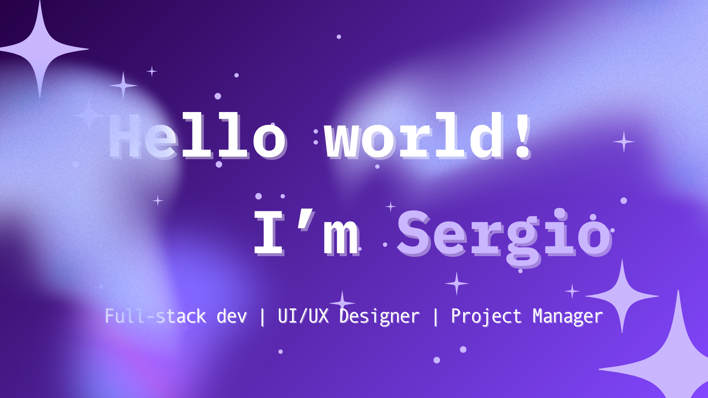
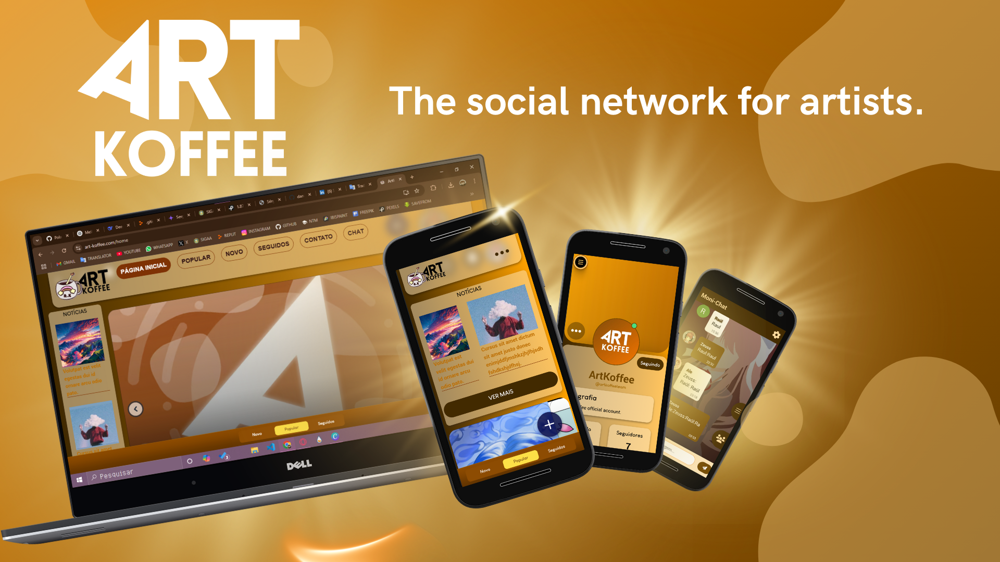
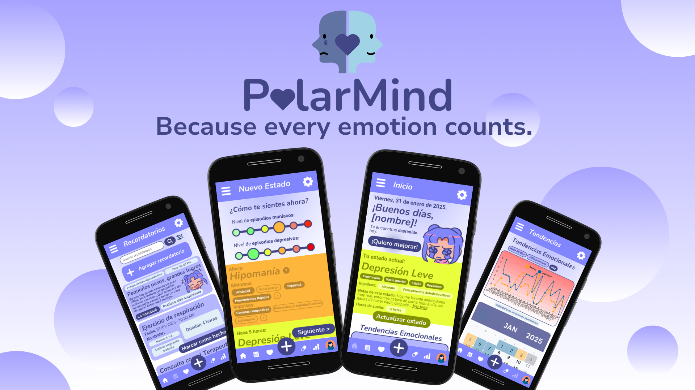
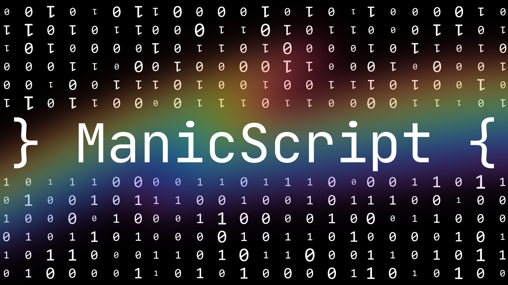
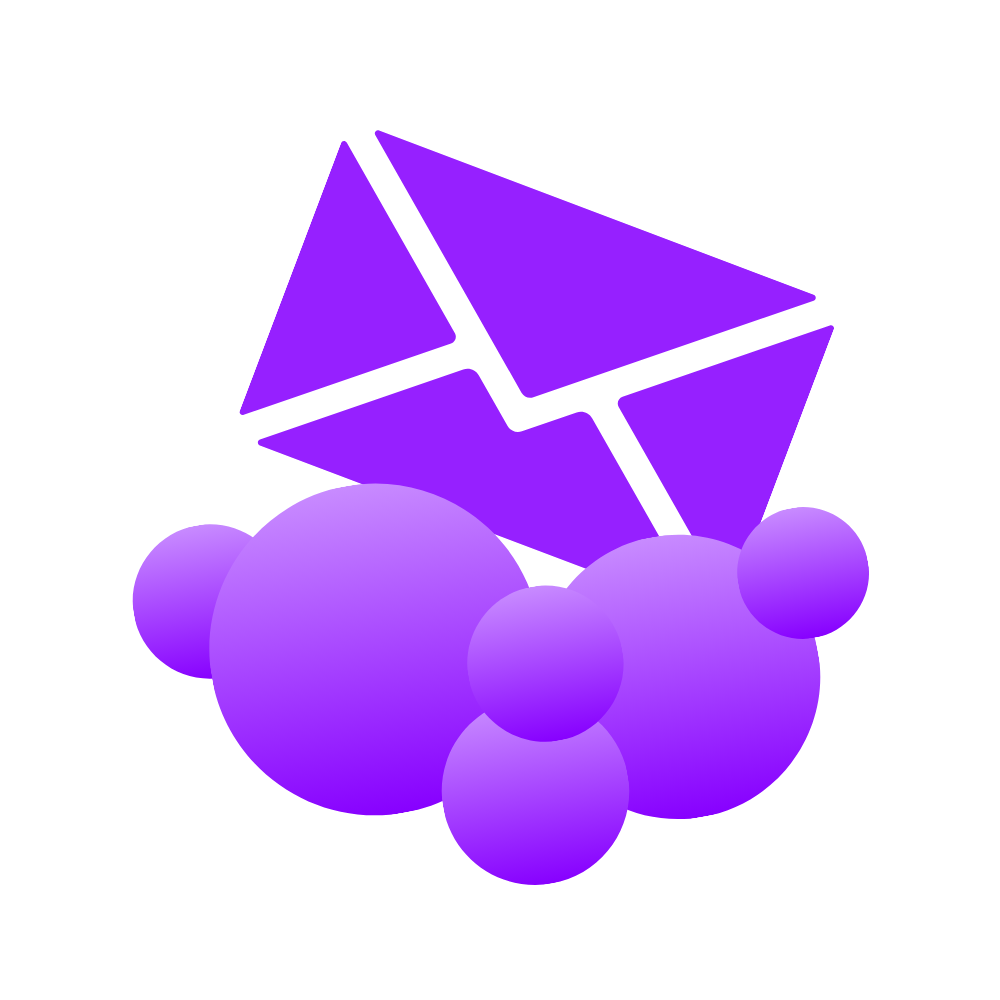
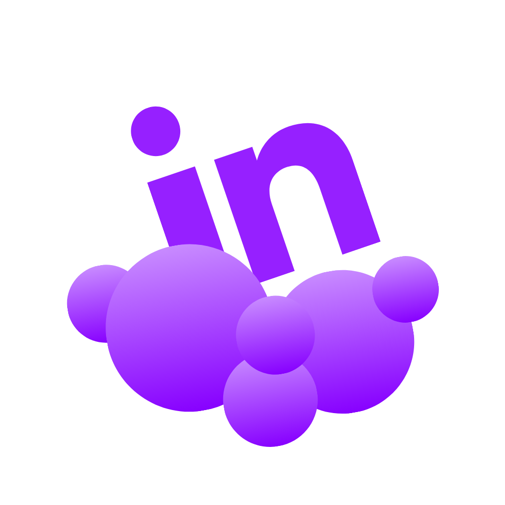
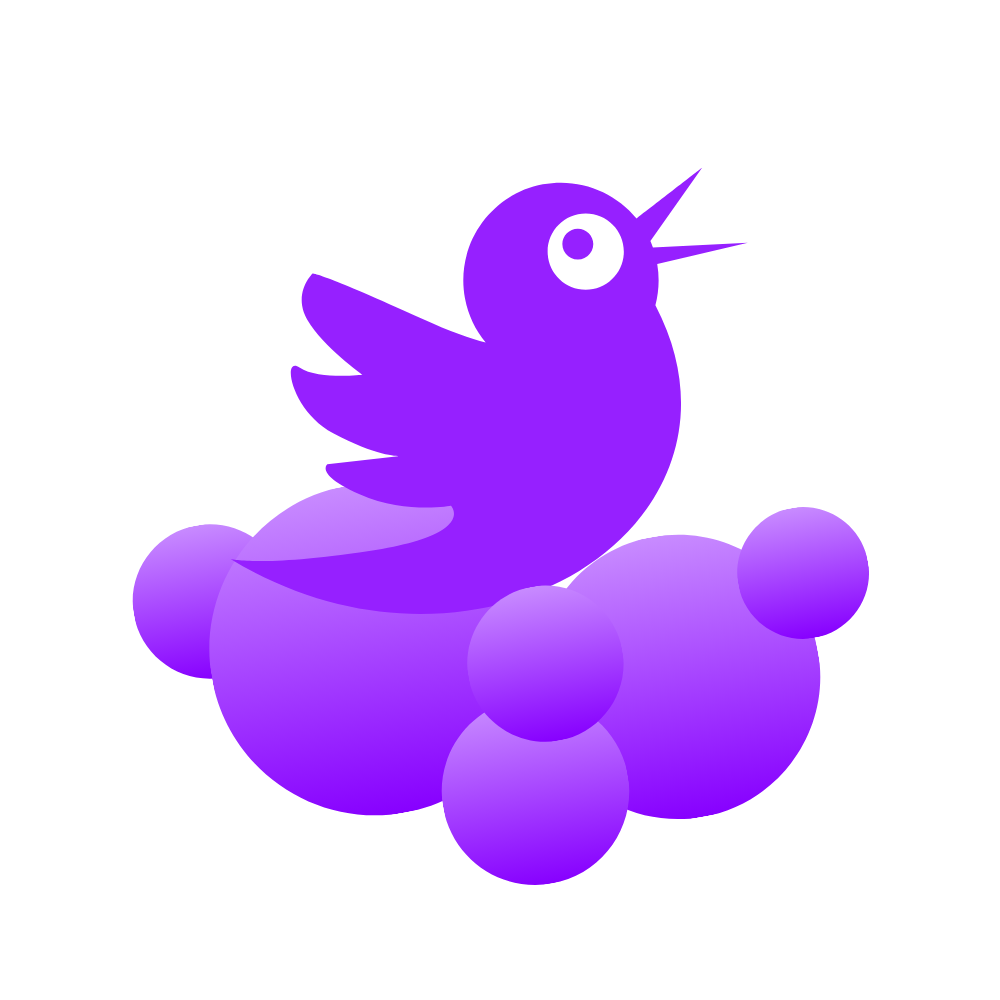

<div align="center">
  
<!--START_SECTION:waka-->


**🐱 My GitHub Data** 

> 📦 433.3 kB Used in GitHub's Storage 
 > 
> 🏆 944 Contributions in the Year 2026
 > 
> 💼 Opted to Hire
 > 
> 📜 8 Public Repositories 
 > 
> 🔑 2 Private Repositories 
 > 
**I'm an Early 🐤** 

```text
🌞 Morning                87 commits          █████████░░░░░░░░░░░░░░░░   37.66 % 
🌆 Daytime                29 commits          ███░░░░░░░░░░░░░░░░░░░░░░   12.55 % 
🌃 Evening                54 commits          ██████░░░░░░░░░░░░░░░░░░░   23.38 % 
🌙 Night                  61 commits          ███████░░░░░░░░░░░░░░░░░░   26.41 % 
```
📅 **I'm Most Productive on Thursday** 

```text
Monday                   12 commits          █░░░░░░░░░░░░░░░░░░░░░░░░   05.19 % 
Tuesday                  2 commits           ░░░░░░░░░░░░░░░░░░░░░░░░░   00.87 % 
Wednesday                43 commits          █████░░░░░░░░░░░░░░░░░░░░   18.61 % 
Thursday                 87 commits          █████████░░░░░░░░░░░░░░░░   37.66 % 
Friday                   20 commits          ██░░░░░░░░░░░░░░░░░░░░░░░   08.66 % 
Saturday                 48 commits          █████░░░░░░░░░░░░░░░░░░░░   20.78 % 
Sunday                   19 commits          ██░░░░░░░░░░░░░░░░░░░░░░░   08.23 % 
```


📊 **This Week I Spent My Time On** 

```text
🕑︎ Time Zone: America/Sao_Paulo

💬 Programming Languages: 
Python                   11 hrs 20 mins      █████████████████████░░░░   85.00 % 
HTML                     1 hr 32 mins        ███░░░░░░░░░░░░░░░░░░░░░░   11.53 % 
JSON                     27 mins             █░░░░░░░░░░░░░░░░░░░░░░░░   03.47 % 

🔥 Editors: 
VS Code                  13 hrs 20 mins      █████████████████████████   100.00 % 

🐱‍💻 Projects: 
ArtKoffee-Admin          7 hrs 38 mins       ██████████████░░░░░░░░░░░   57.27 % 
ArtKoffeeOfficial        5 hrs 42 mins       ███████████░░░░░░░░░░░░░░   42.73 % 

💻 Operating System: 
Windows                  13 hrs 20 mins      █████████████████████████   100.00 % 
```

**I Mostly Code in HTML** 

```text
HTML                     8 repos             ██████████████░░░░░░░░░░░   57.14 % 
Python                   5 repos             █████████░░░░░░░░░░░░░░░░   35.71 % 
C++                      1 repo              ██░░░░░░░░░░░░░░░░░░░░░░░   07.14 % 
```


 Last Updated on 11/04/2026 19:12:27 UTC
<!--END_SECTION:waka-->
</div>



<div align="center">
  <br><br>
  
</div><br>
<table align="center">
  <tr align="center">
    <td align="center">
      <br />
      
    </td>
  </tr>
</table>
<br><br><br><br>
<div align="center">
  <h2>Advanced in the following technologies:</h2>
  <br><br><br><br>
  
  <ul type="none"><h3>Backend developing</h3>
    <li>
       (+6 years of experience)
    </li>
    <li>
       (+4 years of experience)
    </li>
    <li>
       (+4 years of experience)
    </li>
    <li>
       (+4 years of experience)
    </li>
  </ul>

  <ul type="none"><h3>Management and developer dashboards</h3>
    <li>
       (+2 years of experience)
    </li>
    <li>
       (+3 years of experience)
    </li>
    <li>
       (+1 year of experience)
    </li>
    <li>
       (+5 years of experience)
    </li>
    <li>
       (+5 years of experience)
    </li>
    <li>
       (+4 years of experience)
    </li>
    <li>
       (+2 years of experience)
    </li>
    <li>
       (+5 years of experience)
    </li>
    <li>
       (+3 years of experience)
    </li>
    <li>
       (+3 years of experience)
    </li>
    <li>
       (+5 years of experience)
    </li>
  </ul>

  <ul type="none"><h3>Database</h3>
    <li>
       (+4 years of experience)
    </li>
    <li>
       (+2 years of experience)
    </li>
    <li>
       (+2 years of experience)
    </li>
    <li>
       (+1 year of experience)
    </li>
  </ul> 
  
  <ul type="none"> <h3>Frontend</h3>
    <li>
       (+7 years of experience)
    </li>
    <li>
       (+6 years of experience)
    </li>
    <li>
       (+5 years of experience)
    </li>
    <li>
       (+3 years of experience)
    </li>
    <li>
       (+3 years of experience)
    </li>
    <li>
       (+4 years of experience)
    </li>
    <li>
       (+2 years of experience)
    </li>
    <li>
       (+3 year of experience)
    </li>
    <li>
       (+5 years of experience)
    </li>
    
  </ul>

  <ul type="none"> <h3>Security, Session, Authentication and Authorization</h3>
    <li>
       (+5 years of experience)
    </li>
  </ul>
  
  
  <br><br><br>

  <h2>Learning the following technologies:</h2>
  <br><br><br><br>
  <ul type="none">
    <li>
       (Focus on frontend)
    </li>
    <li>
       (Focus on database)
    </li>
    <li>
       (Focus on backend)
    </li>
    <li>
       (Focus on frontend)
    </li>
  </ul>
</div> <br><br><br><br>


---

## જ⁀➴ My projects

### - ArtKoffee *(in development)*

<table>
  <tr>
    <td width="500px">
      
    </td>
    <td>
      <strong>A social network for artists share their creations.</strong><br>
      🔗 <a href="https://github.com/ArtKoffee/ArtKoffee">Repo</a> | 🌐 <a href="https://www.art-koffee.com/home">Website</a>
    </td>
  </tr>
</table>

---

### - PolarMind *(in development)*

<table>
  <tr>
    <td width="500px">
      
    </td>
    <td>
      <strong>Application for recording mood states, helping people with bipolar disorder.</strong><br>
      🔗 <a href="https://github.com/CatZeuss/PolarMind">Repo</a>
    </td>
  </tr>
</table>

---

### - ManicScript *(Finished)*

<table>
  <tr>
    <td width="500px">
      
    </td>
    <td>
      <strong>A parody programming language, created for experimentation and learning.</strong><br>
      🔗 <a href="https://github.com/CatZeuss/ManicScript">Repo</a>
    </td>
  </tr>
</table>

---

## જ⁀➴ Contact me!


<div align="center">
  <table>
    <tr>
      <td align="center" style="text-align: center; padding: 10px;">
        
        <br />
        <a href="mailto:zeuss.developer@gmail.com">zeuss.developer@gmail.com</a>
      </td>
      <td align="center" style="text-align: center; padding: 10px;">
        
        <br />
        <a href="https://www.linkedin.com/in/sergio-r-molina/">Sergio Ruiz</a>
      </td>
      <td align="center" style="text-align: center; padding: 10px;">
        
        <br />
        <a href="https://twitter.com/AltZeussim">@AltZeussim</a>
      </td>
    </tr>
  </table>
</div>


